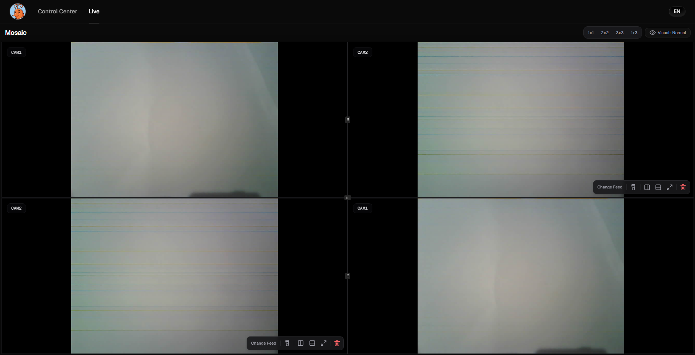
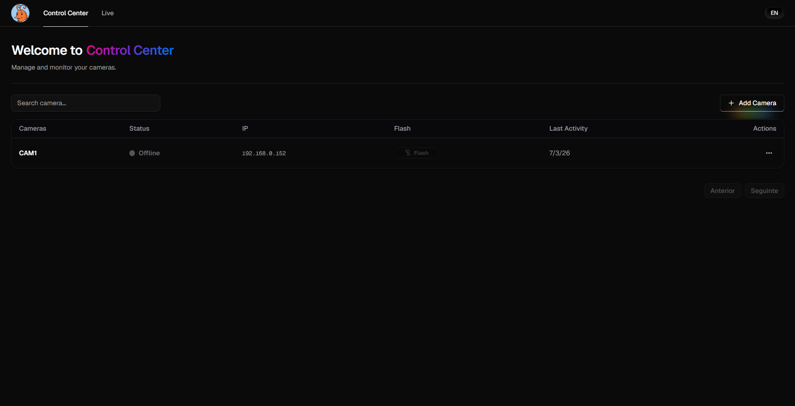
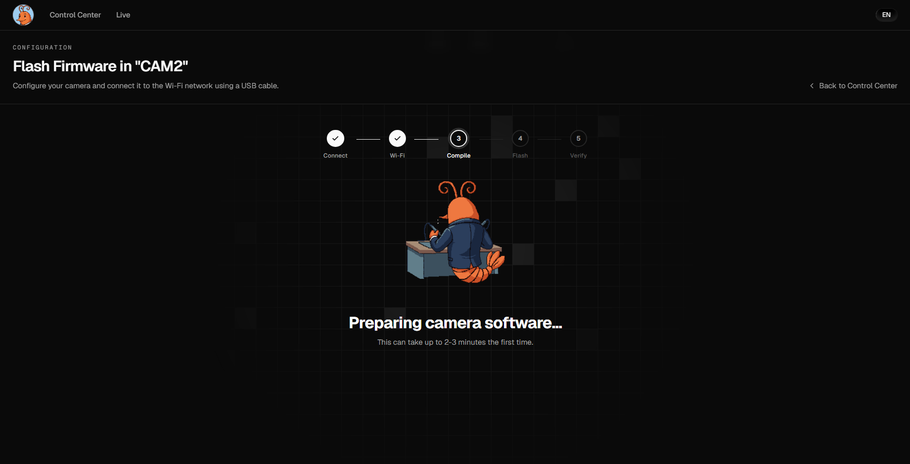
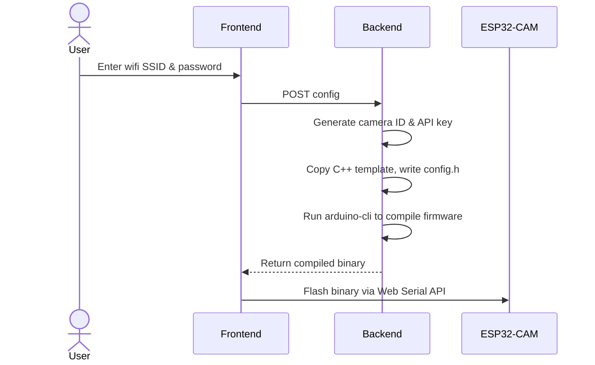
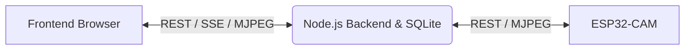

<p align="center">
  
</p>

# <p align="center">CAMron</p>

<p align="center">
  <strong>Open-source, low-cost video surveillance platform.</strong><br/>
  View / manage cameras and flash custom firmware directly from your browser. No code.
</p>

<p align="center">
  
  
  
  
  
  
  
  
  
  
</p>

> **Disclaimer:** **CAMron** has no affiliation with the rapper **[Cam'ron](https://en.wikipedia.org/wiki/Cam%27ron)** aka **Killa CAM**, pioneer of the _pink fur coat_.

---

## Table of Contents

- [CAMron](#camron)
  - [Table of Contents](#table-of-contents)
  - [What is CAMron?](#what-is-camron)
    - [Key Features](#key-features)
  - [Screenshots](#screenshots)
  - [Supported Hardware](#supported-hardware)
  - [Browser Compatibility](#browser-compatibility)
  - [How it Works](#how-it-works)
  - [Architecture](#architecture)
  - [Getting Started](#getting-started)
    - [1. Create a project directory](#1-create-a-project-directory)
    - [2. Create the Docker Compose file](#2-create-the-docker-compose-file)
    - [3. Start the application](#3-start-the-application)
    - [4. Open the web dashboard](#4-open-the-web-dashboard)
    - [Configuration Variables](#configuration-variables)
  - [Flashing Guide](#flashing-guide)
    - [Hardware you'll need](#hardware-youll-need)
    - [Drivers](#drivers)
    - [Connect the hardware](#connect-the-hardware)
    - [Configure wifi](#configure-wifi)
    - [Write the firmware](#write-the-firmware)
  - [Security](#security)
  - [Roadmap](#roadmap)
  - [Contributing](#contributing)
    - [Local Development](#local-development)
  - [FAQ](#faq)
      - [Why can't the browser find any serial ports?](#why-cant-the-browser-find-any-serial-ports)
      - [Why did the first container startup take so long?](#why-did-the-first-container-startup-take-so-long)
      - [Why does the compilation process take a long time?](#why-does-the-compilation-process-take-a-long-time)
      - [Why does the camera fail to connect to my wifi?](#why-does-the-camera-fail-to-connect-to-my-wifi)
      - [Why does the camera show as offline in the dashboard?](#why-does-the-camera-show-as-offline-in-the-dashboard)
  - [License](#license)

---

## What is CAMron?

Most DIY camera projects are a pain to set up. You need to download an IDE, install packages, manage libraries, edit C++ files and manually flash the firmware.
Commercial security cameras are expensive, require subscriptions, and store video on external cloud servers.

**CAMron** is a simpler alternative. It's a self-hosted platform for **ESP32-CAM** modules that compiles and flashes custom firmware straight from your browser using the **Web Serial API**. No code editing or compiler installation required on your end.

### Key Features

- **No Code Editing**: enter your wifi in the web UI and the backend handles the C++ compilation for you.
- **Browser Flashing**: writes the binary straight to your ESP32-CAM over USB, no external flashing tool needed.
- **Local and Private**: no cloud dependencies, video never leaves your local network.
- **Camera Management**: monitor streams and toggle camera flashlights from a single dashboard.

## Screenshots

<div align="center">
  
  
  
</div>

---

## Supported Hardware

- **Camera Module:** Standard ESP32-CAM board.
- **Programmer:** An ESP32-CAM-MB micro-USB adapter board.
- **Cable:** Data-transfer USB cable (some cables are only for charging, even if they have that [tree-like icon](https://starfirecableshubs.com/wp-content/uploads/2023/01/4-1-1024x590.png) on it).

_Note: Other boards are not officially supported (currently). I dont have them and they probably have a different pin layout. Tho feel free to test them and if they are actualy supported, let me know_

---

## Browser Compatibility

Flashing relies on the **Web Serial API**, which requires a compatible browser and a **Secure Context** (HTTPS or `localhost`).

- **Local Host:** If you run and access CAMron on the same machine (e.g. at `http://localhost:3005`), Web Serial works out of the box.
- **Remote Host / NAS:** If you host CAMron on a separate machine (like a NAS) and access it via a local IP (e.g. `http://192.168.1.100:3005`), modern browsers will block the Web Serial API. To flash in this scenario, you can:
  1. **Temporary Local Access:** Temporarily run CAMron locally on your flashing computer (your laptop/desktop) just to perform the initial flash, then access the dashboard on the NAS.
  2. **Enable HTTPS:** Place CAMron behind a reverse proxy (like Caddy, Nginx, or Traefik) with SSL/HTTPS enabled.
  3. **Browser Flag (Workaround):** Access `chrome://flags/#unsafely-treat-insecure-origin-as-secure` in Chrome/Edge, add your CAMron URL (e.g., `http://192.168.1.100:3005`), enable the flag, and restart the browser.

---

## How it Works



## Architecture

The system is split into a Next.js frontend and a Node.js/Express backend, talking over REST and SSE, with the backend proxying the camera's video stream so multiple dashboard clients can watch it at once.



Full breakdown of the database schema, the setup/flashing sequence, and the runtime registration/streaming flow: [docs/architecture.md](docs/architecture.md).

---

## Getting Started

Just want to run CAMron? Follow the steps below using our pre-built Docker images. If you want to contribute instead skip to [Local Development](#local-development).

### 1. Create a project directory

```bash
mkdir camron && cd camron
```

### 2. Create the Docker Compose file

Create a file named `docker-compose.yml` in that directory and paste the following:

```yaml
services:
  gateway:
    image: nginx:alpine
    ports:
      - "${FRONTEND_PORT:-3005}:80"
    configs:
      - source: nginx_config
        target: /etc/nginx/conf.d/default.conf
    depends_on:
      - frontend
      - backend
    restart: unless-stopped

  backend:
    image: ghcr.io/jauzin23/camron-backend:latest
    environment:
      - PORT=3000
      - CAMERA_BEARER_TOKEN=${CAMERA_BEARER_TOKEN:-unused_legacy_token}
      - HOST_IP=${HOST_IP:-your_computer_local_ip_here}
      - PUBLIC_PORT=${FRONTEND_PORT:-3005}
      - APP_PIN=${APP_PIN:-1234}
      - JWT_SECRET=${JWT_SECRET:-some_random_secret_key_here}
      - JWT_EXPIRY=${JWT_EXPIRY:-15m}
    volumes:
      - backend-data:/app/data
      - arduino-core-data:/home/node/.arduino15
    restart: unless-stopped

  frontend:
    image: ghcr.io/jauzin23/camron-frontend:latest
    depends_on:
      - backend
    restart: unless-stopped

configs:
  nginx_config:
    content: |
      server {
          listen 80;
          server_name localhost;

          # Proxy API requests to the backend
          location /api/ {
              proxy_pass http://backend:3000/api/;
              proxy_http_version 1.1;
              proxy_set_header Upgrade $$http_upgrade;
              proxy_set_header Connection 'upgrade';
              proxy_set_header Host $$host;
              proxy_cache_bypass $$http_upgrade;
              client_max_body_size 50M;
          }

          # Proxy video stream requests to backend
          location /stream {
              proxy_pass http://backend:3000/stream;
              proxy_http_version 1.1;
              proxy_set_header Upgrade $$http_upgrade;
              proxy_set_header Connection 'upgrade';
              proxy_set_header Host $$host;
              proxy_buffering off;
              proxy_cache off;
              client_max_body_size 0;
          }

          # Proxy the rest of the requests to Next.js
          location / {
              proxy_pass http://frontend:3005/;
              proxy_http_version 1.1;
              proxy_set_header Upgrade $$http_upgrade;
              proxy_set_header Connection 'upgrade';
              proxy_set_header Host $$host;
              proxy_cache_bypass $$http_upgrade;
          }
      }

volumes:
  backend-data:
  arduino-core-data:
```

### 3. Start the application

Set the values in a `.env` file (see [Configuration Variables](#configuration-variables) below), or define them directly in the `docker-compose.yml` environment section.

```bash
docker compose up -d
```

> **Note:** The first time you run this command, the backend container will automatically download and install the ESP32 core into a persistent volume. This initial setup takes **5-10 minutes**, but subsequent container restarts and app builds will start instantly.

### 4. Open the web dashboard

Navigate to `http://localhost:3005` in Chrome or Edge.

### Configuration Variables

Create a `.env` file in the same directory if you want to customize your installation:

| Name            | Required? | Description                                                  | Example         |
| --------------- | --------- | ------------------------------------------------------------ | --------------- |
| `FRONTEND_PORT` | No        | Public port for the Nginx gateway (accessible by browsers).  | `3005`          |
| `HOST_IP`       | Yes\*     | Local LAN IP of the host machine (where backend is running). | `192.168.1.100` |
| `APP_PIN`       | Yes\*     | 4-digit security PIN to access the dashboard.                | `1234`          |
| `JWT_SECRET`    | Yes\*     | Secret key used for signing session JWT tokens.              | `secret_key`    |
| `JWT_EXPIRY`    | No        | JWT token expiration time (e.g., 15m, 1h, 1d).               | `15m`           |

_\*If not defined in a `.env` file, replace these placeholder values directly in the `docker-compose.yml` environment section._

The two variables below only apply if you're running the backend and frontend outside Docker, see [Local Development](#local-development):

| Name                      | Required? | Description                                                   | Example                 |
| ------------------------- | --------- | ------------------------------------------------------------- | ----------------------- |
| `BACKEND_PORT`            | No        | Internal port for the local Express backend (non-Docker dev). | `3000`                  |
| `NEXT_PUBLIC_BACKEND_URL` | No        | Local backend API URL used by the frontend browser bundle.    | `http://localhost:3000` |

---

## Flashing Guide

Once the app is running, here's how to get a physical camera flashed and online.

### Hardware you'll need

- An ESP32-CAM module (standard AI-Thinker board).
- An ESP32-CAM-MB USB programmer adapter. This is the only flashing method that's actually been tested, other programmers (FTDI, etc) might work in theory but aren't verified, so they're not listed as supported.
- A data-transfer USB cable, not a charge-only one.

### Drivers

Most ESP32-CAM-MB boards use either a **CH340** or a **CP2102** USB-to-serial chip, usually printed on the chip itself near the USB port. If the flashing page shows "No compatible serial ports found" after you connect, that's almost always a missing driver for one of those two chips. Install the matching driver for your OS, then fully restart your browser (not just the tab) before trying again.

### Connect the hardware

1. Plug the ESP32-CAM onto the ESP32-CAM-MB adapter, then connect the adapter to your computer via USB.
2. On the flashing page, click connect. The browser will prompt you to pick a serial port, select the one that corresponds to your programmer and confirm.

### Configure wifi

Enter the SSID and password for the network the camera will use. The ESP32-CAM **only** supports **2.4GHz** wifi.

### Write the firmware

The backend compiles the firmware in the background using the wifi settings you just entered, this takes only a few seconds after the first compile. Once it's done, the frontend writes the binaries straight to the ESP32-CAM. Keep the board connected until the progress bar finishes.

The camera reboots automatically once flashing completes and connects to the wifi you configured. It should show up as online in the dashboard within a few seconds. If it doesn't, check [Why does the camera show as offline in the dashboard?](#why-does-the-camera-show-as-offline-in-the-dashboard)

---

## Security

CAMron is designed for trusted local networks. Its current security model assumes that your home network is safe.

- **Dashboard Authentication:** Access to the web dashboard is protected by a 4-digit PIN (set via the `APP_PIN` environment variable), which generates a short-lived JWT session token for the browser.
- **Camera Authentication:** Each camera generates a unique 256-bit API key during the flashing process. This key is stored in plaintext in the backend's SQLite database and embedded in the camera's firmware. The camera uses this key as a Bearer token to authorize connections from the backend (like viewing the stream or toggling the flash).
- **External Access:** **Do not expose CAMron directly to the internet.** The dashboard relies on a simple PIN and all traffic, including the video stream, is transmitted via unencrypted HTTP. If you need remote access, use a secure VPN (like Tailscale or WireGuard) or place CAMron behind a reverse proxy (like Nginx or Cloudflare Tunnels) with SSL and strong authentication.

---

## Roadmap

COMING SOON

## Contributing

For details on how to contribute, see [CONTRIBUTING.md](CONTRIBUTING.md).

### Local Development

1. **Clone the repository:**
   ```bash
   git clone https://github.com/jauzin23/CAMron.git
   cd CAMron
   ```
2. **Configure environment variables:**
   Copy `.env.example` to `.env` and set `HOST_IP` to your computer's local network IP.
3. **Build and run from source:**
   ```bash
   docker-compose up --build
   ```

---

## FAQ

#### Why can't the browser find any serial ports?

You probably dont have the needed drivers for your programmer chip. Install them and restart your browser.

#### Why did the first container startup take so long?

To keep the Docker image small (~300MB instead of 11GB), the ESP32 core is not baked into the image. Instead, it is installed into a persistent Docker volume on the very first start. This takes 5-10 minutes depending on your internet connection. Subsequent starts and code updates are way faster.

#### Why does the compilation process take a long time?

The first build compiles all base dependencies. Subsequent compilations are cached and complete in less than 10 seconds.

#### Why does the camera fail to connect to my wifi?

This might be due to a couple of reasons:

- The ESP32-CAM **only** supports **2.4 GHz** wifi networks.
- Check the SSID and password for typos and flash the board again.

#### Why does the camera show as offline in the dashboard?

Ensure that `HOST_IP` in `.env` is set to your computer's local network IP (e.g. `192.168.x.x`), not `localhost`.

---

## License

This project is licensed under the [MIT License](LICENSE).
