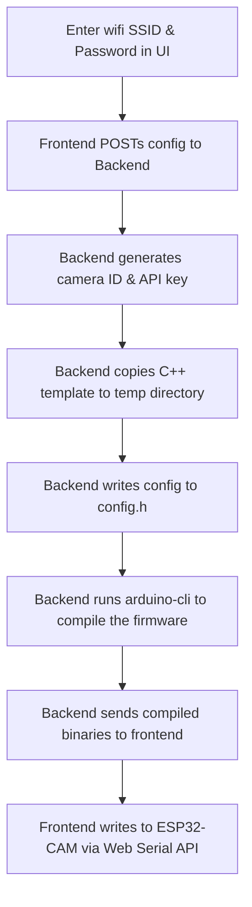

# <p align="center">CAMron</p>

<p align="center">
  
</p>

<p align="center">
  <strong>Open-source, low-cost video surveillance platform.</strong><br/>
  View / manage cameras and flash custom firmware directly from your browser. No code
</p>

<p align="center">
  
  
  
  
  
  
  
  
  
  
</p>

> **Disclaimer:** **CAMron** has no affiliation with the rapper **[Cam'ron](https://en.wikipedia.org/wiki/Cam%27ron)** aka **Killa CAM**, pioneer of the _pink fur coat_.

---

## What is CAMron?

Most DIY camera projects are difficult to set up. They require downloading an IDE , installing packages, managing libraries, editing C++ files and manually flashing.
Commercial security cameras are expensive, require subscriptions, and store video on external cloud servers.

**CAMron** is a simpler alternative. It is a self-hosted platform for **ESP32-CAM** modules that compiles and flashes custom firmware directly from your browser using the **Web Serial API**. No code editing or compiler installation is required on the user's end.

### Key Features

- **No Code Editing:** Enter your wifi in the web UI, and the backend handles the C++ compilation.
- **Browser Flashing:** Writes the binary directly to your ESP32-CAM over USB on your browser.
- **Local and Private:** No cloud dependencies. Video does not leave your local network.
- **Camera Management:** Monitor streams and toggle camera flashlights from a single dashboard.

## Demo


---

## Supported Hardware

- **Camera Module:** Standard ESP32-CAM board.
- **Programmer:** An ESP32-CAM-MB micro-USB adapter board.
- **Cable:** Data-transfer USB cable (some cables are only for charging, even if they have that [tree-like icon](https://starfirecableshubs.com/wp-content/uploads/2023/01/4-1-1024x590.png) on it).

_Note: Other boards are not officially supported (currently). I dont have them and they probably have a different pin layout. Tho feel free to test them and if they are actualy supported, let me know_

---

## Browser Compatibility

Flashing relies on the **Web Serial API**, which requires a compatible browser.
This feature has been tested on Google Chrome, Microsoft Edge and Opera (windows versions).

---

## How it Works



---

## Getting Started

1. **Clone the repo:**
   ```bash
   git clone https://github.com/jauzin23/CAMron.git
   cd CAMron
   ```
2. **Configure environment variables:**
   Copy `.env.example` to `.env` and set `HOST_IP` to your computer's local network IP (e.g. `192.168.1.100`). Do not use `localhost` or `127.0.0.1`.
3. **Start the application:**
   ```bash
   docker-compose up
   ```
4. **Open the web dashboard:**
   Navigate to `http://localhost:3005` in Chrome or Edge.

---

## Contributing

For details on how to contribute, see [CONTRIBUTING.md](CONTRIBUTING.md).

---

## FAQ

#### Why can't the browser find any serial ports?

You probably dont have the needed drivers for your programmer chip. Install them and restart your browser.

#### Why does the compilation process take a long time?

The first build downloads core packages and compiles dependencies. Subsequent compilations are cached and complete in less than 10 seconds.

#### Why does the camera fail to connect to my wifi?

This might be due to a couple of reasons:

- The ESP32-CAM only supports **2.4 GHz** wifi networks (it cannot connect to 5 GHz networks).
- Check the SSID and password for typos and flash the board again.

#### Why does the camera show as offline in the dashboard?

Ensure that `HOST_IP` in `.env` is set to your computer's local network IP (e.g. `192.168.x.x`), not `localhost`.

---

## License

This project is licensed under the [MIT License](LICENSE).
