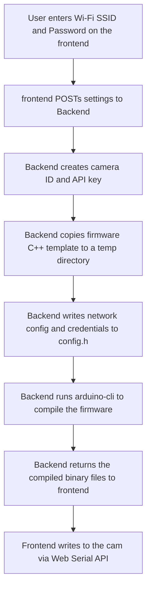

# 
CAMron

  

  <strong>An open-source, low-cost video surveillance platform.</strong> 
  Flash custom firmware directly from your browser. No terminals, IDEs, or coding required.

  
  
  
  
  
  
  
  
  
  

> **Disclaimer:** **CAMron** bears no affiliation with legendary rapper **[Cam'ron](https://en.wikipedia.org/wiki/Cam%27ron)** aka **Killa CAM**, pioneer of the _pink fur coat._

---

## The Mission

Home security and peace of mind shouldn't be expensive luxurie.

**CAMron** is a self-hosted, private, and low-cost home monitoring platform designed for everyone. By using the **ESP32-CAM**, anyone can set up their own home monitoring network without spending hundreds on commercial systems.

## Why is CAMron Different?

Most DIY security camera projects require you to install an IDE, configure libraries, and edit C++ files manually just to connect to your Wi-Fi. On the other hand, commercial systems are expensive, require subscriptions, and store your private video feeds in the cloud.

**CAMron** offers the best of both worlds:

- **Zero Code Required:** If you can type your Wi-Fi password into a browser, you can set up a CAMron camera. The heavy lifting (firmware compilation and flashing) is done entirely through the web interface.
- **100% Local & Private:** No cloud servers, no hidden tracking, and no subscriptions. Your video feeds never leave your local network.
- **Low-Cost:** Avoid expensive hardware. CAMron works seamlessly with the standard ESP32-CAM modules.

## No-Code Web Flashing

Traditionally, setting up ESP32 cameras requires downloading the Arduino IDE (or an equivalent), installing drivers, managing libraries, and manually editing C++ code files.

**CAMron** completely removes this barrier:

1. **Connect** your ESP32-CAM to your computer via USB.
2. **Type** your Wi-Fi name (SSID) and Password into the web interface.
3. The backend automatically compiles a custom firmware on the _backend_.
4. The frontend writes the compiled firmware directly to your device via the browser using the **Web Serial API**.
5. The camera reboots, auto-connects to your Wi-Fi, registers with the dashboard, and starts streaming immediately.

**Zero lines of code written**

## Main Features

- **Dynamic Firmware Compilation**: Automatically bakes your Wi-Fi configuration and host credentials into the firmware.
- **Direct-to-Device Web Serial Flashing**: Flash ESP32-CAM directly from Google Chrome or Microsoft Edge.
- **Local & Private**: No cloud connections, no subscriptions, and no external servers. Your video feeds stay on your local network.
- **Dynamic Camera Management**: Easily edit, reboot, toggle camera flashlights, and manage all camera devices from a single center.

## Demo

---

## Supported Hardware and ESP32 Variants

CAMron is designed specifically to work with the standard ESP32-CAM module. This is the model that uses the AI-Thinker pinout, has an OV2640 camera sensor, and includes external PSRAM. Other ESP32 camera boards, such as the ESP32-WROVER or ESP32-S3-CAM, are not supported because they use different pin layouts and different compiler options.

To flash the camera, you will also need a micro-USB adapter like the ESP32-CAM-MB adapter or an FTDI Programmer. You must make sure that you use a micro-USB cable that is capable of transferring data, as many cables only carry power.

---

## Browser Compatibility

The flashing feature uses the Web Serial API to write the compiled firmware to your device. This means you must use a compatible web browser.

The following browsers are tested and fully compatible:

- Google Chrome

Mozilla Firefox and Apple Safari are not compatible because they do not support the Web Serial API.

## How Dynamic Compilation Works

The diagram below shows how the backend compiles the camera firmware when you request a flash.

## Prerequisites

You must install Docker to run CAMron locally.

## Getting Started

First, clone this repository to your local computer and open a terminal inside the project folder.

Second, copy the `.env.example` file to a new file named `.env`. Open the `.env` file and configure the settings. You must set `HOST_IP` to the local LAN IP address of your computer. Do not use `localhost` or `127.0.0.1`.

Third, start the platform by running the command `docker-compose up` in your terminal.

Finally, open `http://localhost:3005`.

## Contributing

We welcome contributions to this project. Before you write any code or submit a pull request, please read our [Contributing Guidelines](CONTRIBUTING.md) to understand our workflow.

You should also read our [Code of Conduct](CODE_OF_CONDUCT.md) to learn about our community standards, and our [Security Policy](SECURITY.md) if you want to report any security vulnerabilities.

## FAQ

**Why does the browser say it cannot find any serial ports?**
You might be missing the USB driver for your adapter chip. Most ESP32-CAM adapters use the CH340 or CP2102 chip. You must download and install these drivers from the manufacturer's website.
**Why does the compilation take a long time?**
The compiler builds everything during the first flash setup. Subsequent compilations will be much faster because the compiler caches the build files.

**Why does the camera fail to connect to my Wi-Fi?**
The ESP32-CAM only supports 2.4 GHz Wi-Fi networks. It cannot connect to 5 GHz networks. Also, make sure you did not make a typo in the **SSID** or **password** when flashing. If you did, you must flash the device again.

**Why does the camera show as offline in the dashboard?**
Make sure that the `HOST_IP` in your `.env` file is set to your computer's actual local LAN IP address and not `localhost`.

## License

This project is licensed under the [MIT License](LICENSE).
