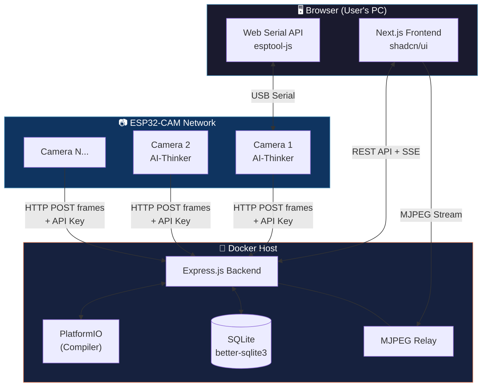
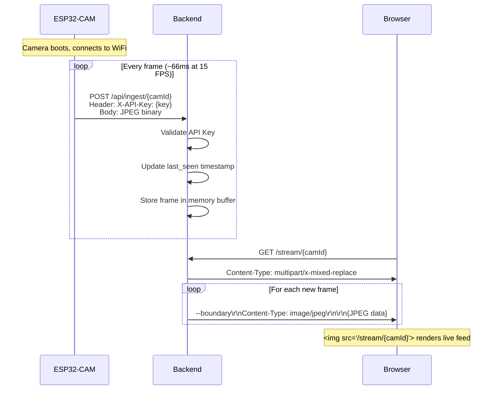
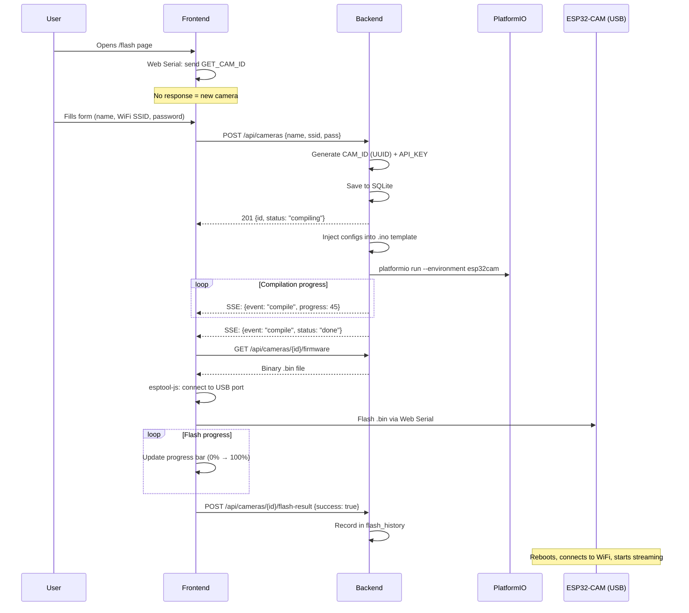
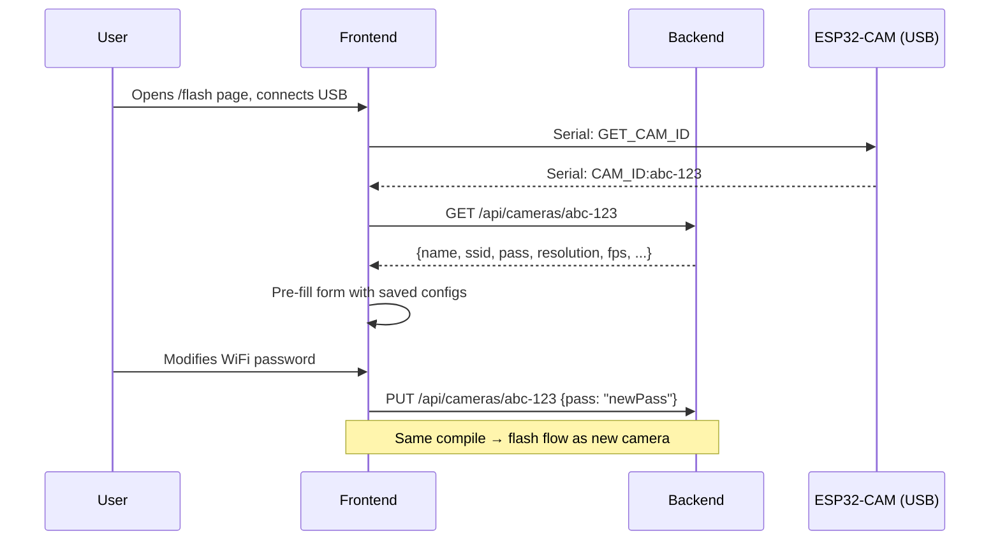
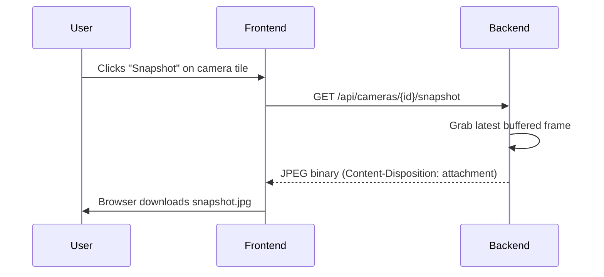
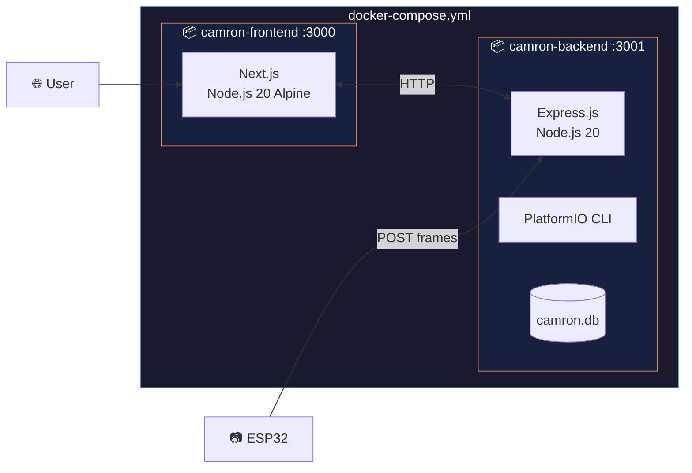
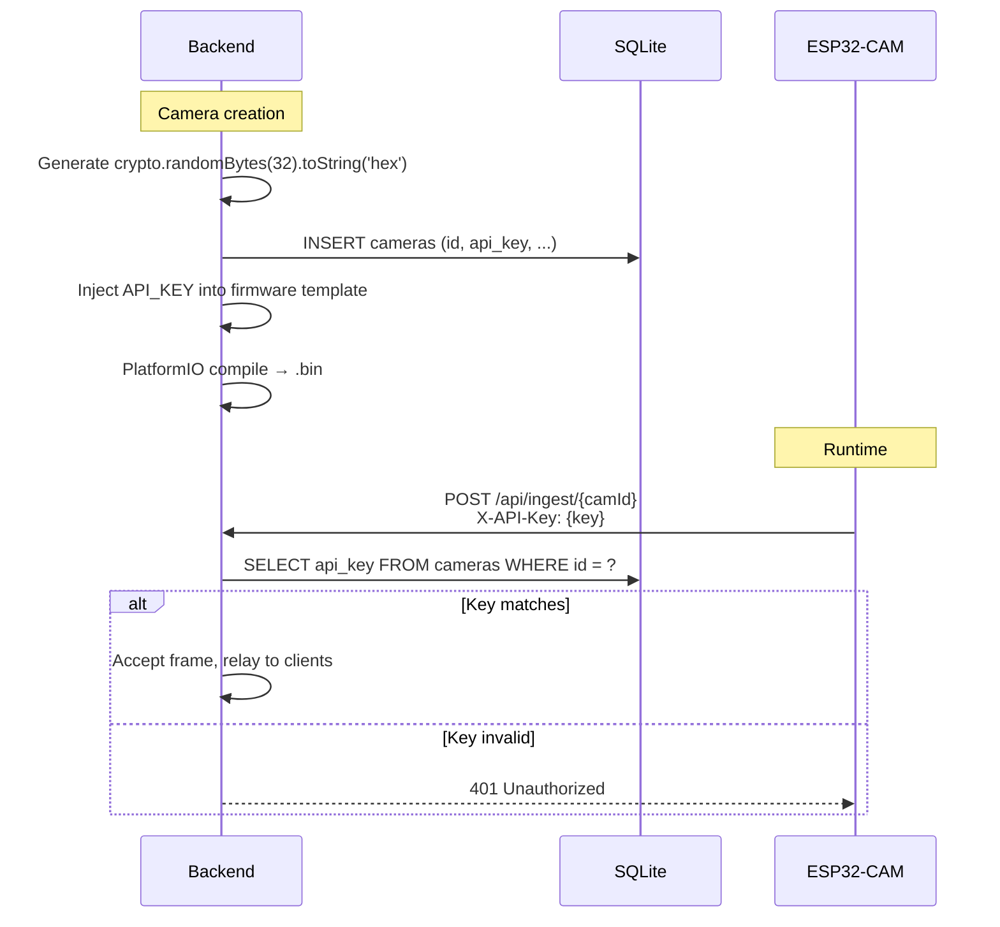

# CAMron — System Architecture

> Open-source self-hosted surveillance platform built around the ESP32-CAM.
> Flash firmware from your browser. No terminal required.

---

## 1. System Overview



### Key Principles

| Principle | Implementation |
|---|---|
| **Push-model streaming** | ESP32 pushes frames to backend — device IPs never exposed |
| **Browser-native flash** | Web Serial API + esptool-js — zero local tooling |
| **Server-side compilation** | PlatformIO in Docker — user never touches a terminal |
| **Minimal infrastructure** | SQLite + 2 Docker containers — no external DB server |
| **Zero authentication** | Single-user, whoever accesses the server has full control |

---

## 2. Component Details

### 2.1 Frontend — Next.js + shadcn/ui

| Aspect | Detail |
|---|---|
| **Framework** | Next.js (React) |
| **UI Library** | shadcn/ui (exclusive — all components from shadcn) |
| **Styling** | Tailwind CSS (shadcn dependency) |
| **Theme** | Custom: Blue `#4A90B8` + Coral `#E8845C`, dark/light toggle |
| **Navigation** | Collapsible sidebar with icons (Discord/Slack style) |
| **Streaming** | `` tag pointing to MJPEG relay endpoint |
| **Flash** | esptool-js via Web Serial API |
| **Language** | JavaScript (no TypeScript) |

#### Pages

| Route | Purpose |
|---|---|
| `/` | Dashboard — drag-and-drop camera grid with live feeds |
| `/flash` | Multi-step wizard to configure and flash a new camera |
| `/cameras` | Camera management — list, edit settings, view status |
| `/cameras/[id]` | Individual camera details and settings |
| `/settings` | Global application settings |

#### Key Frontend Features

- **Drag-and-drop grid**: Users organize camera feeds spatially. Layout persisted.
- **Fullscreen mode**: Click any camera tile to expand to fullscreen with controls.
- **Flash wizard**: Multi-step (Name → WiFi → Compile progress → Flash progress → Done).
- **Serial handshake**: On flash page, automatically sends `GET_CAM_ID` to detect if camera is already configured.
- **Snapshot**: One-click capture → instant download as JPEG.
- **Mobile responsive**: Grid adapts from 1-column (mobile) to NxN (desktop).

### 2.2 Backend — Express.js

| Aspect | Detail |
|---|---|
| **Framework** | Express.js |
| **Database** | SQLite via `better-sqlite3` (synchronous, zero config) |
| **Compiler** | PlatformIO CLI (installed in Docker container) |
| **Streaming** | MJPEG relay (multipart/x-mixed-replace) |
| **Events** | Server-Sent Events (SSE) for real-time updates |
| **Language** | JavaScript (Node.js, no TypeScript) |

#### Core Responsibilities

1. **REST API** — CRUD for cameras and settings
2. **Compilation Pipeline** — Inject configs into `.ino` template → PlatformIO compile → serve `.bin`
3. **Frame Ingestion** — Receive HTTP POST frames from ESP32s, validate API key
4. **MJPEG Relay** — Forward ingested frames to browser clients as MJPEG stream
5. **SSE Events** — Push real-time events (compilation progress, camera status changes)
6. **Snapshot** — Capture latest frame from a camera and serve as download

### 2.3 Firmware — PlatformIO (C++)

| Aspect | Detail |
|---|---|
| **Platform** | PlatformIO (ESP32 Arduino framework) |
| **Target Board** | AI-Thinker ESP32-CAM |
| **Camera Sensor** | OV2640 |
| **Language** | C++ (Arduino) |

#### Firmware Responsibilities

1. **WiFi Connection** — Connect using credentials injected at compile time
2. **Frame Capture** — Capture JPEG frames from OV2640 at configured resolution/FPS
3. **HTTP POST Push** — Send each frame to `{SERVER_URL}/api/ingest/{CAM_ID}` with API key in header
4. **Serial Listener** — Respond to `GET_CAM_ID` command with `CAM_ID:{id}` for identification
5. **Configurable Settings** — Resolution, FPS, JPEG quality, rotation, mirror, flip (set at compile time)

#### Firmware Template Variables

These placeholders in the `.ino` template are replaced at compile time:

```cpp
#define WIFI_SSID       "{{WIFI_SSID}}"
#define WIFI_PASS       "{{WIFI_PASS}}"
#define SERVER_URL      "{{SERVER_URL}}"
#define CAM_ID          "{{CAM_ID}}"
#define API_KEY         "{{API_KEY}}"
#define CAM_RESOLUTION  {{RESOLUTION}}    // e.g., FRAMESIZE_VGA
#define CAM_FPS         {{FPS}}           // e.g., 15
#define CAM_JPEG_QUAL   {{JPEG_QUALITY}}  // e.g., 12
#define CAM_ROTATION    {{ROTATION}}      // 0, 90, 180, 270
#define CAM_HMIRROR     {{HMIRROR}}       // 0 or 1
#define CAM_VFLIP       {{VFLIP}}         // 0 or 1
#define CAM_BRIGHTNESS  {{BRIGHTNESS}}    // -2 to 2
#define CAM_CONTRAST    {{CONTRAST}}      // -2 to 2
#define CAM_SATURATION  {{SATURATION}}    // -2 to 2
```

---

## 3. Data Flow Diagrams

### 3.1 Live Streaming



### 3.2 Flash Workflow (New Camera)



### 3.3 Re-flash Workflow (Existing Camera)



### 3.4 Snapshot Capture



---

## 4. API Specification

### 4.1 REST Endpoints

| Method | Path | Description | Request Body | Response |
|---|---|---|---|---|
| `POST` | `/api/cameras` | Create camera & trigger compilation | `{name, wifi_ssid, wifi_pass}` | `201 {id, api_key, status}` |
| `GET` | `/api/cameras` | List all cameras | — | `200 [{id, name, status, last_seen, ...}]` |
| `GET` | `/api/cameras/:id` | Get camera details | — | `200 {id, name, wifi_ssid, ...}` |
| `PUT` | `/api/cameras/:id` | Update camera configs (triggers recompile) | `{name?, wifi_ssid?, wifi_pass?, ...}` | `200 {id, status: "compiling"}` |
| `DELETE` | `/api/cameras/:id` | Remove camera | — | `204` |
| `GET` | `/api/cameras/:id/firmware` | Download compiled `.bin` | — | `200 binary/octet-stream` |
| `GET` | `/api/cameras/:id/snapshot` | Capture latest frame as download | — | `200 image/jpeg` |
| `POST` | `/api/cameras/:id/flash-result` | Report flash success/failure | `{success: boolean}` | `200` |
| `GET` | `/stream/:id` | MJPEG relay stream | — | `200 multipart/x-mixed-replace` |
| `POST` | `/api/ingest/:id` | ESP32 frame ingestion | Binary JPEG (header: `X-API-Key`) | `200` |
| `GET` | `/api/settings` | Get global settings | — | `200 {server_url, ...}` |
| `PUT` | `/api/settings` | Update global settings | `{server_url?, ...}` | `200` |

### 4.2 SSE Events

**Endpoint:** `GET /api/events`

| Event | Data | Description |
|---|---|---|
| `compile:progress` | `{camera_id, progress: 0-100}` | Compilation progress update |
| `compile:done` | `{camera_id}` | Compilation completed successfully |
| `compile:error` | `{camera_id, error: string}` | Compilation failed |
| `camera:online` | `{camera_id}` | Camera started sending frames |
| `camera:offline` | `{camera_id}` | Camera stopped sending frames (timeout) |

### 4.3 ESP32 → Backend Ingestion

```
POST /api/ingest/{cam_id}
Headers:
  X-API-Key: {api_key}
  Content-Type: image/jpeg
Body: Raw JPEG binary data
```

The backend validates the API key against the `cameras` table. If invalid, returns `401 Unauthorized`.

---

## 5. Database Schema

### SQLite — `camron.db`

```sql
-- Core camera table
CREATE TABLE cameras (
    id            TEXT PRIMARY KEY,                        -- UUID (CAM_ID)
    api_key       TEXT UNIQUE NOT NULL,                    -- Auth key for ESP32
    name          TEXT NOT NULL,                           -- User label ("Living Room")
    wifi_ssid     TEXT NOT NULL,                           -- WiFi network name
    wifi_pass     TEXT NOT NULL,                           -- WiFi password
    server_url    TEXT NOT NULL,                           -- Backend URL for frame push
    -- Image settings (compiled into firmware)
    resolution    TEXT DEFAULT 'VGA',                      -- QQVGA|QVGA|CIF|VGA|SVGA|XGA|SXGA|UXGA
    fps           INTEGER DEFAULT 15,                      -- Target frames per second
    jpeg_quality  INTEGER DEFAULT 12,                      -- 1-63 (lower = better quality)
    brightness    INTEGER DEFAULT 0,                       -- -2 to 2
    contrast      INTEGER DEFAULT 0,                       -- -2 to 2
    saturation    INTEGER DEFAULT 0,                       -- -2 to 2
    rotation      INTEGER DEFAULT 0,                       -- 0, 90, 180, 270
    hmirror       INTEGER DEFAULT 0,                       -- 0 or 1
    vflip         INTEGER DEFAULT 0,                       -- 0 or 1
    -- Runtime metadata
    last_seen     TEXT,                                    -- ISO 8601 timestamp of last frame
    created_at    TEXT DEFAULT (datetime('now')),
    updated_at    TEXT DEFAULT (datetime('now'))
);

-- Flash history for audit and re-flash tracking
CREATE TABLE flash_history (
    id            INTEGER PRIMARY KEY AUTOINCREMENT,
    camera_id     TEXT NOT NULL REFERENCES cameras(id) ON DELETE CASCADE,
    flashed_at    TEXT DEFAULT (datetime('now')),
    success       INTEGER DEFAULT 1                        -- 0 = failed, 1 = success
);

-- Global settings
CREATE TABLE settings (
    key           TEXT PRIMARY KEY,
    value         TEXT NOT NULL
);

-- Default settings
INSERT INTO settings (key, value) VALUES ('server_url', 'http://localhost:3001');
INSERT INTO settings (key, value) VALUES ('offline_timeout_seconds', '30');
INSERT INTO settings (key, value) VALUES ('theme', 'dark');
```

### Field Notes

- **`cameras.id`**: UUID v4, generated server-side. Embedded into firmware as `CAM_ID`.
- **`cameras.api_key`**: Crypto-random 32-byte hex string. Used in `X-API-Key` header for frame ingestion.
- **`cameras.wifi_pass`**: Stored in plaintext (needed for re-flash pre-fill). Acceptable for single-user self-hosted.
- **`cameras.last_seen`**: Updated on every frame received. Camera is considered offline if `now() - last_seen > offline_timeout_seconds`.
- **`cameras.jpeg_quality`**: ESP32 OV2640 range is 1-63 where lower = better quality but more bandwidth.
- **`flash_history`**: Tracks every flash attempt for debugging. `ON DELETE CASCADE` cleans up when camera is deleted.

---

## 6. Docker Architecture

### Container Layout



### docker-compose.yml (Planned Structure)

```yaml
version: "3.8"

services:
  frontend:
    build: ./packages/frontend
    ports:
      - "3000:3000"
    environment:
      - NEXT_PUBLIC_API_URL=http://backend:3001
    depends_on:
      - backend

  backend:
    build: ./packages/backend
    ports:
      - "3001:3001"
    environment:
      - CAMRON_SERVER_URL=http://YOUR_SERVER_IP:3001
      - PORT=3001
    volumes:
      - camron-data:/app/data        # SQLite DB + compiled binaries
      - camron-pio:/root/.platformio  # PlatformIO cache (speeds up builds)

volumes:
  camron-data:
  camron-pio:
```

### Backend Dockerfile Notes

The backend container needs:
- **Node.js 20** (for Express.js + better-sqlite3)
- **Python 3** (PlatformIO dependency)
- **PlatformIO CLI** (`pip install platformio`)
- **ESP32 platform** pre-installed (`pio platform install espressif32`)

This makes the backend image ~800MB-1GB. The PlatformIO cache volume ensures subsequent compilations are fast (~10-15s vs ~60s first run).

---

## 7. Security Model

| Threat | Mitigation |
|---|---|
| **ESP32 IP exposure** | Push model — ESP32 sends TO backend, never exposes an HTTP server |
| **Unauthorized frame injection** | Each camera has a unique `API_KEY` validated on every POST |
| **WiFi credential theft** | Stored in SQLite on user's own server. No cloud, no external access |
| **Stream interception** | MJPEG relay only accessible from backend's network. Use reverse proxy + HTTPS for external access |
| **Firmware tampering** | Compilation happens server-side in isolated Docker container |

### API Key Flow



---

## 8. Directory Structure

```
CAMron/
├── packages/
│   ├── frontend/                    # Next.js application
│   │   ├── src/
│   │   │   ├── app/                 # Next.js App Router pages
│   │   │   │   ├── page.jsx         # Dashboard (camera grid)
│   │   │   │   ├── flash/
│   │   │   │   │   └── page.jsx     # Flash wizard
│   │   │   │   ├── cameras/
│   │   │   │   │   ├── page.jsx     # Camera list
│   │   │   │   │   └── [id]/
│   │   │   │   │       └── page.jsx # Camera details
│   │   │   │   └── settings/
│   │   │   │       └── page.jsx     # Global settings
│   │   │   ├── components/
│   │   │   │   ├── ui/              # shadcn/ui components
│   │   │   │   ├── layout/
│   │   │   │   │   ├── sidebar.jsx
│   │   │   │   │   └── theme-toggle.jsx
│   │   │   │   ├── dashboard/
│   │   │   │   │   ├── camera-grid.jsx
│   │   │   │   │   ├── camera-tile.jsx
│   │   │   │   │   └── fullscreen-view.jsx
│   │   │   │   ├── flash/
│   │   │   │   │   ├── flash-wizard.jsx
│   │   │   │   │   ├── step-config.jsx
│   │   │   │   │   ├── step-compile.jsx
│   │   │   │   │   ├── step-flash.jsx
│   │   │   │   │   └── step-done.jsx
│   │   │   │   └── cameras/
│   │   │   │       ├── camera-card.jsx
│   │   │   │       └── camera-settings-form.jsx
│   │   │   ├── lib/
│   │   │   │   ├── api.js           # Backend API client
│   │   │   │   ├── serial.js        # Web Serial helpers
│   │   │   │   ├── flash.js         # esptool-js wrapper
│   │   │   │   └── sse.js           # SSE client helpers
│   │   │   └── hooks/
│   │   │       ├── use-cameras.js
│   │   │       ├── use-serial.js
│   │   │       └── use-sse.js
│   │   ├── public/
│   │   ├── Dockerfile
│   │   ├── next.config.js
│   │   ├── tailwind.config.js
│   │   └── package.json
│   │
│   ├── backend/                     # Express.js API server
│   │   ├── src/
│   │   │   ├── index.js             # Express app entry point
│   │   │   ├── routes/
│   │   │   │   ├── cameras.js       # Camera CRUD routes
│   │   │   │   ├── ingest.js        # Frame ingestion endpoint
│   │   │   │   ├── stream.js        # MJPEG relay
│   │   │   │   ├── settings.js      # Global settings
│   │   │   │   └── events.js        # SSE endpoint
│   │   │   ├── services/
│   │   │   │   ├── compiler.js      # PlatformIO compilation logic
│   │   │   │   ├── relay.js         # Frame relay/buffer management
│   │   │   │   └── camera-status.js # Online/offline detection
│   │   │   ├── db/
│   │   │   │   ├── connection.js    # better-sqlite3 setup
│   │   │   │   └── migrations.js    # Schema creation
│   │   │   └── middleware/
│   │   │       ├── api-key.js       # API key validation
│   │   │       └── error-handler.js
│   │   ├── firmware/                # PlatformIO project template
│   │   │   ├── platformio.ini
│   │   │   ├── src/
│   │   │   │   └── main.cpp         # Template with {{PLACEHOLDERS}}
│   │   │   └── lib/
│   │   ├── data/                    # SQLite DB + compiled .bin cache
│   │   ├── Dockerfile
│   │   └── package.json
│   │
│   └── firmware/                    # Reference firmware documentation
│       ├── README.md
│       └── pin-mappings/
│           └── ai-thinker.md
│
├── docker/                          # Shared Docker configs
│   └── .env.example
├── docker-compose.yml
├── package.json                     # Root workspace config
├── README.md
├── LICENSE
├── logo.png
└── docs/
    ├── architecture.md              # This document
    ├── competitive-analysis.md
    ├── roadmap.md
    └── project-spec.md
```

---

## 9. Theme & Design System

### CSS Custom Properties

```css
/* CAMron Theme — based on logo colors */
:root {
  /* Primary: Blue (from logo background) */
  --primary: 201 40% 50%;           /* #4A90B8 */
  --primary-foreground: 0 0% 100%;

  /* Accent: Coral/Orange (from logo shrimp) */
  --accent: 16 73% 63%;             /* #E8845C */
  --accent-foreground: 0 0% 100%;

  /* Semantic */
  --success: 142 76% 36%;           /* Green — camera online */
  --destructive: 0 84% 60%;         /* Red — camera offline / errors */
  --warning: 38 92% 50%;            /* Amber — compiling / pending */
}

.dark {
  --background: 222 47% 11%;        /* Deep navy */
  --card: 217 33% 17%;              /* Slightly lighter */
  --muted: 215 20% 25%;
}

.light {
  --background: 0 0% 98%;
  --card: 0 0% 100%;
  --muted: 210 20% 96%;
}
```

### Component Usage (shadcn/ui)

| Component | Usage in CAMron |
|---|---|
| `Sidebar` | Main navigation (collapsible) |
| `Card` | Camera tiles, settings panels |
| `Dialog` | Fullscreen camera view, confirmations |
| `Form` + `Input` | Flash wizard, camera settings |
| `Stepper` / custom | Flash wizard progress |
| `Button` | Actions (Flash, Snapshot, Delete) |
| `Badge` | Camera status (Online/Offline) |
| `Tooltip` | Icon-only sidebar labels |
| `DropdownMenu` | Camera tile actions (Edit, Delete, Snapshot) |
| `Switch` | Theme toggle, mirror/flip settings |
| `Slider` | Brightness, contrast, saturation |
| `Select` | Resolution, FPS selection |
| `Collapsible` | Advanced settings section |
| `Toast` | Notifications (flash success, errors) |
| `Progress` | Compilation and flash progress bars |
| `Skeleton` | Loading states |

---

## 10. Resolution Mapping

| Enum Value | PlatformIO Constant | Resolution | Typical Use |
|---|---|---|---|
| `QQVGA` | `FRAMESIZE_QQVGA` | 160×120 | Minimal bandwidth |
| `QVGA` | `FRAMESIZE_QVGA` | 320×240 | Low quality preview |
| `CIF` | `FRAMESIZE_CIF` | 400×296 | Medium preview |
| `VGA` | `FRAMESIZE_VGA` | 640×480 | **Default** — good balance |
| `SVGA` | `FRAMESIZE_SVGA` | 800×600 | Higher quality |
| `XGA` | `FRAMESIZE_XGA` | 1024×768 | High quality |
| `SXGA` | `FRAMESIZE_SXGA` | 1280×1024 | Very high |
| `UXGA` | `FRAMESIZE_UXGA` | 1600×1200 | Maximum (slow FPS) |

> [!WARNING]
> Higher resolutions significantly reduce FPS on ESP32-CAM. At UXGA, expect ~2-5 FPS. VGA at 15 FPS is the recommended default.
