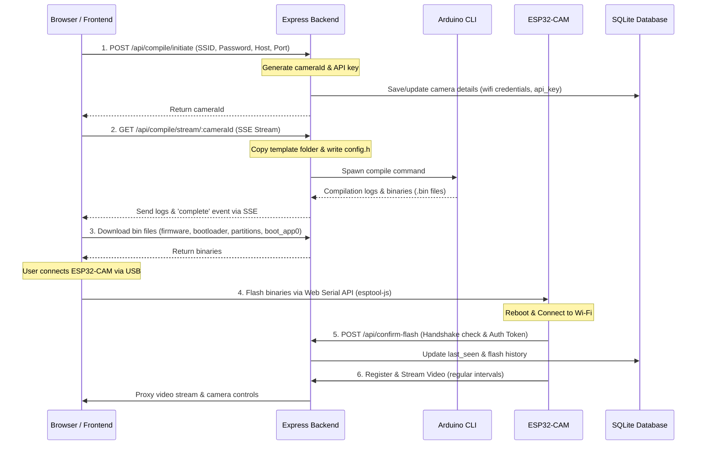

# CAMron Architecture

This document describes how the different parts of CAMron work together to let you configure, compile, and flash firmware onto your camera.

## Core Components

The project consists of four main parts:

The frontend is a **Next.js** web application. It's the user interface where you can monitor active camera streams and flash firmware.

The backend is a **Node.js** and **Express** application. It handles the **API** requests, uses the db, manages the compilation of the firmware, and proxies the video streams from the cameras.

The database is a local SQLite database.

The camera is an **ESP32-CAM** module running custom **C++** firmware. It connects to your Wi-Fi network and streams video back to the backend.

## Flashing and Handshake Workflow

Here is how the system behaves when you set up a new camera.

