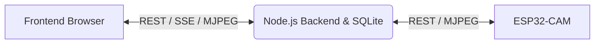
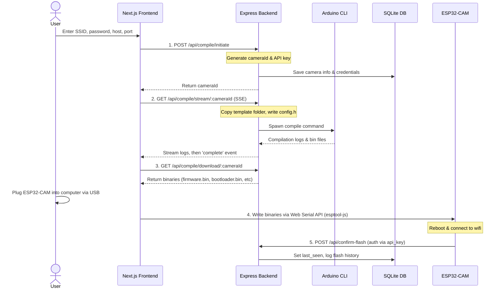
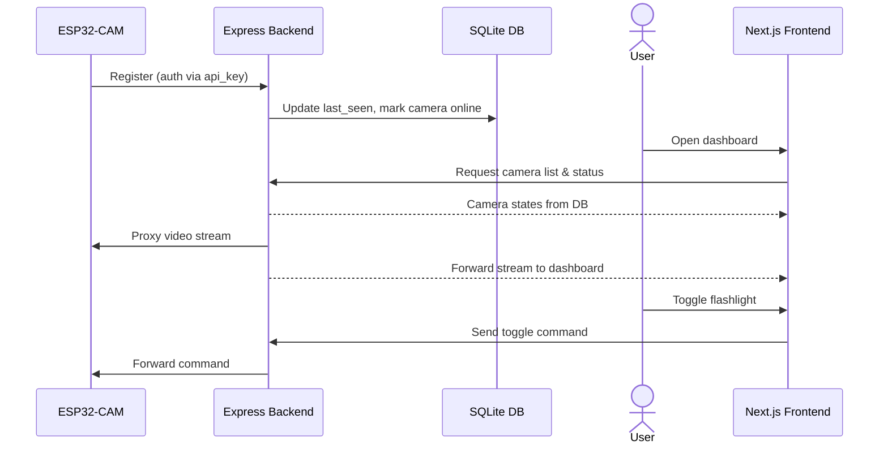

# Architecture

This page breaks down how CAMron's components talk to each other.

## Stack

- **Frontend:** Next.js / React
- **Backend:** Node.js + Express
- **Database:** SQLite
- **Camera:** ESP32-CAM

## Overview

- **Communication:** the frontend talks to the backend over a REST API for configuration and state, and uses Server-Sent Events (SSE) to stream compilation logs and camera connection status in real time.
- **Database:** a local SQLite database holds a `cameras` table (camera ID, randomly generated API key, IP, wifi credentials, online status), a `flash_history` table, and `settings`.
- **Video streaming:** the ESP32-CAM serves a local MJPEG stream. The browser doesn't connect to the camera directly, the backend proxies and multiplexes that stream (`GET /stream`), so multiple dashboard clients can view the same camera at once without overloading the ESP32.

## Setup & Flashing Flow

What happens when you set up a new camera, from entering wifi credentials to the board booting with firmware on it:

## Runtime: Registration & Streaming

Once a camera is flashed, this repeats every time it boots or reconnects, not just once during setup:

