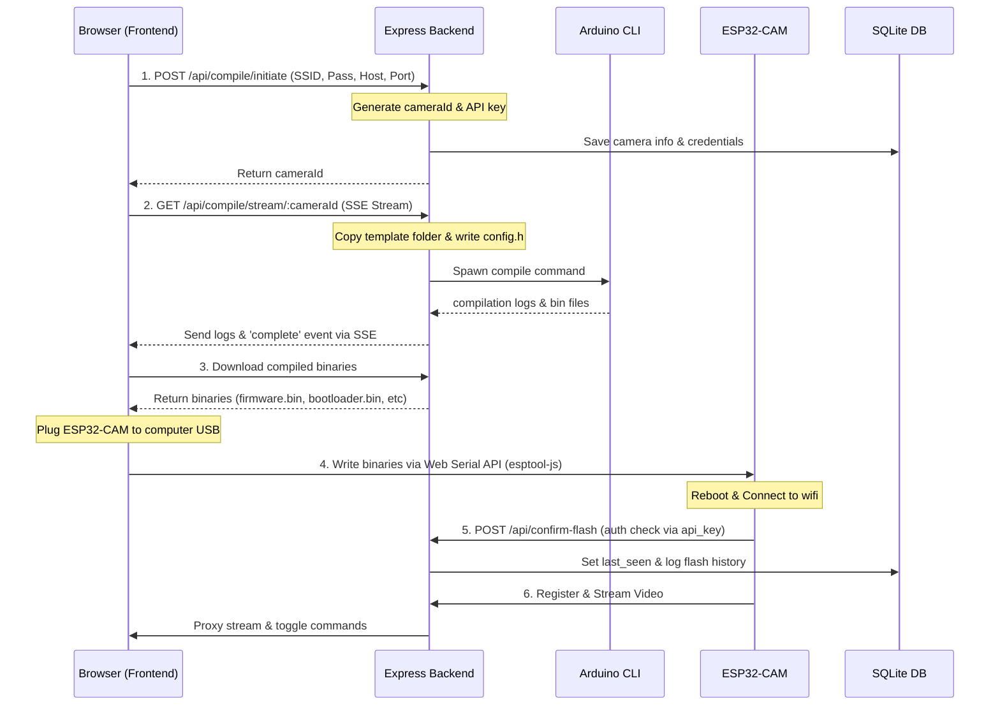

# Architecture Overview

This page breaks down how CAMron's components talk to each other.

## Stack

- **Frontend (Next.js)**
- **Backend (Node.js + Express)**
- **Database (SQLite)**
- **Camera (ESP32-CAM)**

---

## Flashing and Connection Flow

Here is exactly what happens when you set up a new camera:

