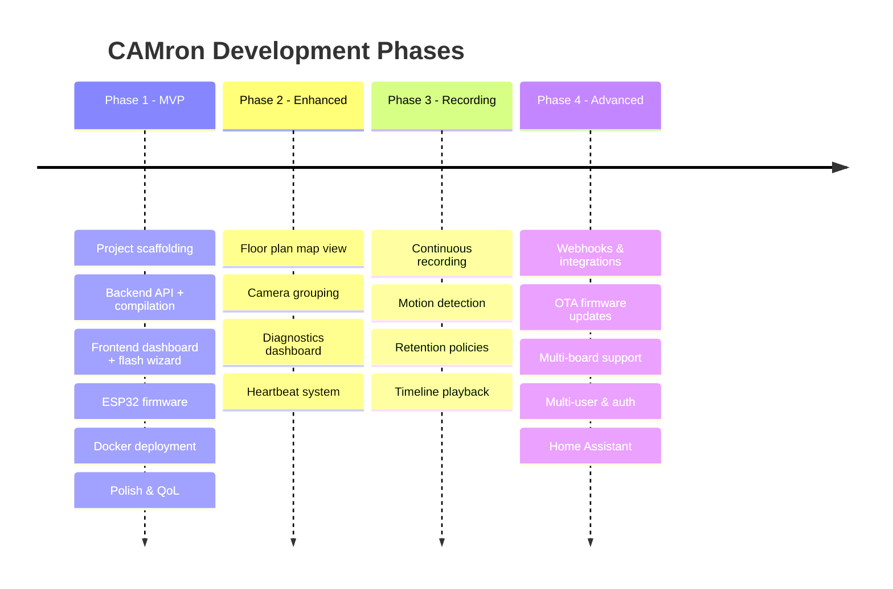
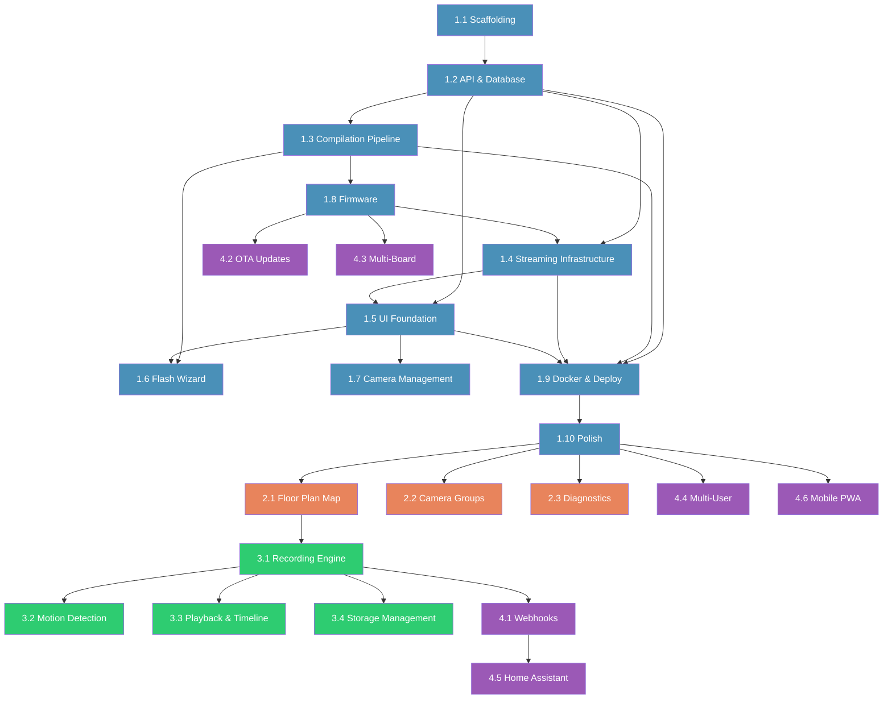

# CAMron — Product Roadmap

> From MVP to full-featured self-hosted surveillance platform.

---

## Phase Overview

---

## Phase 1: MVP (Core) — Est. 6-8 weeks

> **Goal:** A working end-to-end system where a user can flash an ESP32-CAM from the browser, see the live feed on a dashboard, and manage cameras.

### Milestone 1.1: Project Scaffolding

| Task | Size | Details |
|---|---|---|
| Initialize monorepo with npm workspaces | S | `packages/frontend`, `packages/backend`, `packages/firmware` |
| Next.js project setup | S | App Router, JavaScript, shadcn/ui initialization |
| Express.js project setup | S | Basic server, middleware, route structure |
| shadcn/ui theme configuration | M | Custom theme with blue `#4A90B8` + coral `#E8845C`, dark/light |
| PlatformIO project template | S | `platformio.ini` for AI-Thinker ESP32-CAM |
| SQLite database setup | S | `better-sqlite3`, schema creation, migrations |
| Docker Compose skeleton | S | 2 containers, volumes, env vars |
| ESLint + Prettier config | S | Consistent code style across packages |

**Dependencies:** None (starting point)
**Value delivered:** Development environment ready for all contributors

---

### Milestone 1.2: Backend — API & Database

| Task | Size | Details |
|---|---|---|
| Camera CRUD routes | M | POST, GET, PUT, DELETE `/api/cameras` |
| Camera model & validation | S | UUID generation, API key generation, input validation |
| Global settings routes | S | GET, PUT `/api/settings` |
| SQLite schema & seed data | S | Create tables, insert default settings |
| Error handling middleware | S | Consistent error responses, logging |
| CORS configuration | S | Allow frontend origin |

**Dependencies:** Milestone 1.1
**Value delivered:** Backend API accepting camera registrations

---

### Milestone 1.3: Backend — Compilation Pipeline

| Task | Size | Details |
|---|---|---|
| Firmware template system | M | `.ino` template with `{{PLACEHOLDER}}` injection |
| PlatformIO compilation service | L | Spawn PlatformIO process, capture output, parse progress |
| SSE events endpoint | M | Real-time compilation progress to frontend |
| Compiled binary storage | S | Store `.bin` in filesystem, serve via API |
| Compilation queue | M | Handle concurrent compilation requests (serialize or queue) |
| Compilation error handling | S | Parse PlatformIO errors, return meaningful messages |

**Dependencies:** Milestone 1.2
**Value delivered:** Server can compile firmware with custom configs
**Risks:**
- PlatformIO compilation time (~60s first run, ~15s cached)
- Docker image size with PlatformIO (~800MB+)
- Concurrent compilations may need queuing

---

### Milestone 1.4: Backend — Streaming Infrastructure

| Task | Size | Details |
|---|---|---|
| Frame ingestion endpoint | M | `POST /api/ingest/:id` — receive JPEG, validate API key |
| MJPEG relay service | L | `GET /stream/:id` — multipart/x-mixed-replace relay |
| Frame buffer management | M | In-memory latest frame per camera, cleanup on disconnect |
| Camera status detection | S | Track `last_seen`, detect offline (timeout) |
| Snapshot endpoint | S | `GET /api/cameras/:id/snapshot` — serve latest frame |
| SSE camera status events | S | Emit `camera:online` / `camera:offline` events |

**Dependencies:** Milestone 1.2
**Value delivered:** Live streaming from ESP32 to browser
**Risks:**
- Memory management with many concurrent streams
- MJPEG relay performance under load
- Frame synchronization between producer (ESP32) and consumer (browser)

---

### Milestone 1.5: Frontend — UI Foundation

| Task | Size | Details |
|---|---|---|
| App layout with collapsible sidebar | M | shadcn Sidebar, navigation links, icons |
| Theme system (dark/light toggle) | M | CSS custom properties, ThemeProvider, toggle button |
| Dashboard page — camera grid | L | Drag-and-drop grid, responsive layout, persist order |
| Camera tile component | M | Live MJPEG feed, name overlay, status badge, actions menu |
| Fullscreen camera view | M | Dialog/modal with larger stream, snapshot button |
| API client library | S | Fetch wrapper for all backend endpoints |
| SSE client hook | S | `useSSE()` hook for real-time events |
| Mobile responsive layout | M | Grid adapts 1-col to N-col, sidebar becomes drawer |

**Dependencies:** Milestone 1.2 (API) + Milestone 1.4 (streaming)
**Value delivered:** User can see live camera feeds in a beautiful grid
**Risks:**
- Drag-and-drop library choice (dnd-kit recommended)
- MJPEG `` tag reconnection on network drops

---

### Milestone 1.6: Frontend — Flash Wizard

| Task | Size | Details |
|---|---|---|
| Flash wizard multi-step UI | L | Step 1: Config → Step 2: Compile → Step 3: Flash → Step 4: Done |
| Step 1: Camera configuration form | M | Name (required), WiFi SSID, WiFi Pass, advanced settings (collapsible) |
| Step 2: Compilation progress | M | SSE listener, progress bar, status messages, error handling |
| Step 3: Flash via Web Serial | L | esptool-js integration, port selection, flash progress |
| Step 4: Success/failure screen | S | Success animation, "View camera" link, or error with retry |
| Serial handshake (GET_CAM_ID) | M | Auto-detect connected camera, pre-fill form if existing |
| Web Serial API wrapper | M | Connect, read, write, disconnect helpers |
| esptool-js wrapper | M | Load binary, connect, flash, progress callbacks |

**Dependencies:** Milestone 1.3 (compilation) + Milestone 1.5 (UI)
**Value delivered:** Complete browser-based flash experience
**Risks:**
- Web Serial API browser compatibility (Chrome/Edge only, no Firefox/Safari)
- esptool-js version compatibility and API stability
- ESP32 boot mode detection (GPIO0 pull-down for flash mode)

---

### Milestone 1.7: Frontend — Camera Management

| Task | Size | Details |
|---|---|---|
| Camera list page | M | Cards with name, status, last seen, actions |
| Camera detail/edit page | M | Edit form with all settings, re-flash button |
| Delete camera confirmation | S | Dialog with warning |
| Snapshot button | S | Click → download JPEG instantly |
| Camera status indicators | S | Green badge (online), red badge (offline), gray (never connected) |

**Dependencies:** Milestone 1.5 (UI)
**Value delivered:** Full camera lifecycle management

---

### Milestone 1.8: Firmware — ESP32-CAM

| Task | Size | Details |
|---|---|---|
| WiFi connection with retry | S | Connect using compiled credentials, retry on failure |
| Camera initialization (OV2640) | M | Pin mapping for AI-Thinker, resolution/quality config |
| HTTP POST frame loop | M | Capture frame → POST to server → repeat at target FPS |
| Serial command listener | S | Listen for `GET_CAM_ID`, respond with `CAM_ID:{id}` |
| LED flash control | S | Disable onboard LED flash (annoying in deployment) |
| Watchdog & error recovery | S | Reset on crash, reconnect WiFi on drop |

**Dependencies:** Milestone 1.3 (template system)
**Value delivered:** Working firmware that streams to backend
**Risks:**
- ESP32-CAM memory constraints (PSRAM usage)
- WiFi stability on cheap modules
- HTTP POST reliability at high FPS

---

### Milestone 1.9: Docker & Deployment

| Task | Size | Details |
|---|---|---|
| Backend Dockerfile | M | Node.js 20 + Python 3 + PlatformIO + ESP32 platform |
| Frontend Dockerfile | S | Node.js 20 Alpine, Next.js build |
| docker-compose.yml | S | 2 services, volumes, env vars, network |
| `.env.example` | S | Document all environment variables |
| Health check endpoints | S | `/health` on both containers |
| Volume management | S | SQLite DB + PlatformIO cache persistence |

**Dependencies:** All previous milestones
**Value delivered:** One-command deployment (`docker compose up`)

---

### Milestone 1.10: Polish & Documentation

| Task | Size | Details |
|---|---|---|
| README.md update | M | Getting started, screenshots, architecture overview |
| Loading states (Skeleton) | S | All pages show skeleton while loading |
| Error boundaries | S | Graceful error handling on all pages |
| Toast notifications | S | Flash success/failure, camera online/offline |
| Empty states | S | "No cameras yet" with CTA to flash page |
| Browser compatibility notice | S | Warn if not Chrome/Edge (Web Serial API) |

**Dependencies:** All milestones
**Value delivered:** Production-ready MVP

---

### Phase 1 — Technical Risks & Mitigations

| Risk | Impact | Likelihood | Mitigation |
|---|---|---|---|
| Web Serial API limited to Chrome/Edge | Medium | High | Clear browser requirement in docs, detection + warning banner |
| PlatformIO compilation slow (~60s) | Low | High | Progress bar UX + PlatformIO cache volume + queue system |
| ESP32-CAM WiFi instability | Medium | Medium | Firmware watchdog, auto-reconnect, status detection on backend |
| esptool-js API changes | Medium | Low | Pin specific version, wrapper abstraction layer |
| Docker image size (>1GB with PlatformIO) | Low | High | Multi-stage build, layer caching, documented in requirements |
| Concurrent compilation conflicts | Medium | Medium | Compilation queue (one at a time) with pending status |

---

## Phase 2: Enhanced Experience — Est. 4-6 weeks

> **Goal:** Rich monitoring experience with map view, diagnostics, and camera organization.

### Milestone 2.1: Floor Plan Map View

| Task | Size | Details |
|---|---|---|
| Leaflet/MapLibre integration | L | Dark-themed map, shadcn-styled controls |
| Camera placement on map | L | Drag cameras to positions, save coordinates to DB |
| Multi-floor support | M | Floor selector, per-floor camera positions |
| Map/Grid view toggle | S | Switch between grid dashboard and map view |
| Camera pin with live preview | M | Hover/click pin to see mini live feed |
| Map settings persistence | S | Zoom level, center, selected floor saved to DB |

**Dependencies:** Phase 1 complete
**Value delivered:** Visual spatial awareness of camera network
**New DB fields:** `cameras.latitude`, `cameras.longitude`, `cameras.floor`, `cameras.map_position_x/y`

---

### Milestone 2.2: Camera Grouping & Zones

| Task | Size | Details |
|---|---|---|
| Groups/zones CRUD | M | Create, edit, delete groups (e.g., "Exterior", "Ground Floor") |
| Assign cameras to groups | S | Multi-select, drag between groups |
| Filter dashboard by group | S | Sidebar shows groups, click to filter grid |
| Group labels on map | S | Visual zones overlaid on floor plan |

**New DB table:** `groups (id, name, color, created_at)`
**New DB field:** `cameras.group_id`

---

### Milestone 2.3: Heartbeat & Diagnostics

| Task | Size | Details |
|---|---|---|
| Firmware heartbeat endpoint | M | ESP32 sends JSON every ~10s (RSSI, uptime, FPS, free heap) |
| Diagnostics storage | S | Time-series data in SQLite (last 24h) |
| Camera detail diagnostics | M | Sparkline charts (signal strength, FPS over time) |
| System status page | M | Server uptime, cameras online count, total bandwidth |

---

### Phase 2 — Technical Risks

| Risk | Impact | Mitigation |
|---|---|---|
| Map library bundle size | Low | Dynamic import, lazy load map component |
| SQLite time-series performance | Medium | Aggressive data pruning (keep last 24h only) |
| Map tile hosting | Low | Use free tile providers (OpenStreetMap, CartoDB dark) |

---

## Phase 3: Recording & Storage — Est. 6-8 weeks

> **Goal:** Record camera feeds, manage storage, and playback historical footage.

### Milestone 3.1: Recording Engine

| Task | Size | Details |
|---|---|---|
| Continuous recording service | XL | MJPEG frames → MP4 segments via ffmpeg |
| Recording toggle per camera | S | Enable/disable recording per camera |
| Segment management | M | Roll files every X minutes, organize by date/camera |
| Storage calculator | S | Estimate disk usage based on resolution/FPS/cameras |

### Milestone 3.2: Motion Detection

| Task | Size | Details |
|---|---|---|
| Server-side frame diff | L | Compare consecutive frames, detect significant changes |
| Motion event creation | M | Store events with timestamp, thumbnail, camera ID |
| Event-triggered recording | M | Only record when motion detected + buffer |
| Motion sensitivity config | S | Per-camera threshold setting |

### Milestone 3.3: Playback & Timeline

| Task | Size | Details |
|---|---|---|
| Timeline UI component | XL | Scrubable timeline with motion event markers |
| Video player | L | Play MP4 segments with seek, speed control |
| Event browser | M | List/filter events by camera, date, type |
| Clip export | M | Select time range → download as MP4 |

### Milestone 3.4: Storage Management

| Task | Size | Details |
|---|---|---|
| Retention policies | M | Auto-delete recordings older than X days |
| Storage dashboard | M | Disk usage per camera, total, projections |
| Cleanup scheduler | S | Background job for retention enforcement |

---

## Phase 4: Integrations & Advanced — Est. 8-12 weeks

> **Goal:** Ecosystem integrations, over-the-air updates, and enterprise features.

### Milestone 4.1: Webhooks & API

| Task | Size | Details |
|---|---|---|
| Webhook configuration UI | M | Define webhook URLs for events |
| Event dispatcher | M | HTTP POST to webhook URLs on camera/motion events |
| Public API documentation | M | OpenAPI/Swagger spec for all endpoints |
| API key management | S | Generate API keys for third-party integrations |

### Milestone 4.2: OTA Firmware Updates

| Task | Size | Details |
|---|---|---|
| Firmware version tracking | S | Store firmware version per camera |
| OTA update endpoint | L | Backend serves `.bin`, ESP32 pulls and self-updates |
| OTA update firmware module | L | ESP32 HTTP OTA client, checksum verification |
| Batch OTA update UI | M | Select cameras → push update to all |

### Milestone 4.3: Multi-Board Support

| Task | Size | Details |
|---|---|---|
| Board configuration system | M | Pin mappings, flash parameters per board model |
| Board selection in wizard | S | Dropdown in flash wizard |
| WROVER-Kit support | M | Pin mapping + testing |
| Freenove ESP32-S3 support | M | Pin mapping + testing (S3 has USB-C native) |

### Milestone 4.4: Multi-User & Authentication

| Task | Size | Details |
|---|---|---|
| User model & auth system | L | bcrypt passwords, JWT sessions |
| Role-based access | M | Admin (full control), Viewer (read-only feeds) |
| User management UI | M | Create, edit, delete users |
| Per-camera permissions | M | Assign camera visibility per user/role |

### Milestone 4.5: Home Assistant Integration

| Task | Size | Details |
|---|---|---|
| MQTT discovery | L | Publish camera entities via MQTT auto-discovery |
| HA custom component | L | Python integration for Home Assistant |
| Camera entity | M | Stream, snapshot, motion events in HA |

### Milestone 4.6: Mobile Experience

| Task | Size | Details |
|---|---|---|
| PWA manifest | S | Installable web app |
| Push notifications | M | Camera offline, motion detected |
| Optimized mobile layout | M | Touch-friendly controls, swipe between cameras |

---

## Dependencies Graph

---

## Success Metrics

### Phase 1 (MVP)
- [ ] Flash an ESP32-CAM from browser in < 3 minutes total
- [ ] See live feed on dashboard within 10 seconds of ESP32 boot
- [ ] Manage 10+ cameras simultaneously without performance degradation
- [ ] `docker compose up` → working system in < 5 minutes
- [ ] Re-flash existing camera with zero manual config re-entry

### Phase 2 (Enhanced)
- [ ] Place cameras on real-world map with multi-floor support
- [ ] View diagnostics (signal strength, FPS) per camera
- [ ] Filter dashboard by camera groups

### Phase 3 (Recording)
- [ ] Record continuously for 7+ days with configurable retention
- [ ] Detect motion events with < 5% false positive rate
- [ ] Scrub timeline and playback any time range

### Phase 4 (Advanced)
- [ ] Update firmware OTA without USB connection
- [ ] Integrate with Home Assistant via MQTT auto-discovery
- [ ] Support 3+ ESP32-CAM board models

---

## Contributing Guide

### For Phase 1 Contributors
- Focus on one milestone at a time
- All UI components must use shadcn/ui exclusively
- JavaScript only (no TypeScript)
- Test flash workflow end-to-end with physical ESP32-CAM hardware
- Use meaningful commit messages: `feat(frontend): add camera grid drag-and-drop`

### Development Priorities
1. **Working > Pretty** — get the data flow working first, then polish UI
2. **Simple > Clever** — readable code over clever abstractions
3. **Documented > Fast** — document decisions, especially firmware quirks
